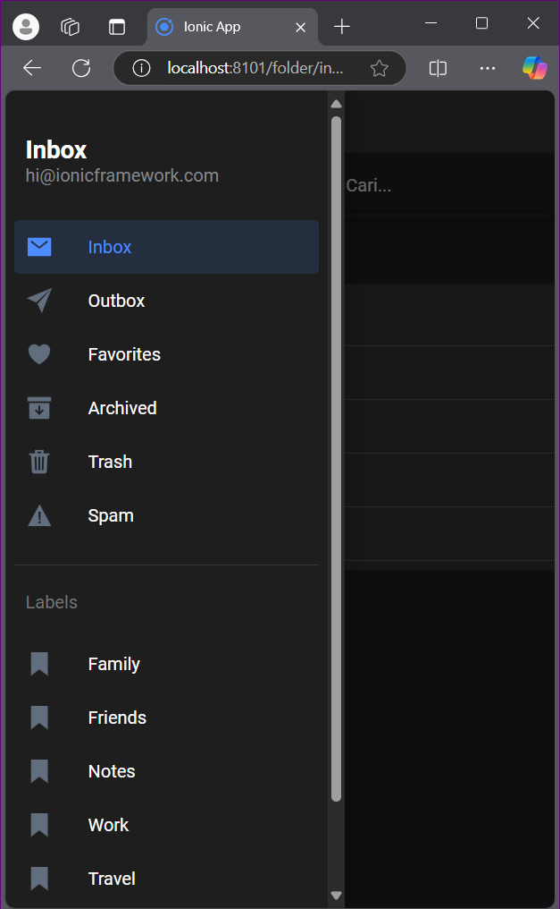

# Tugas6Praktikum2024

# Langkah-Langkah :
1) Tulis kode di file fisrtApp\src\app\folder\folder.page.html sesuai di gambar
2) Tulis kode di file fisrtApp\src\app\folder\folder.page.ts

1. Deklarasi Kelas

export class FolderPage implements OnInit {
  public folder!: string; // Menyimpan nama folder
  public isInboxPage: boolean = false; // Menyimpan status apakah halaman ini adalah inbox
  public isDisabled = true; // Variabel untuk mengontrol status reorder
  private activatedRoute = inject(ActivatedRoute); // Menggunakan dependency injection untuk mendapatkan ActivatedRoute
folder: Variabel ini menyimpan nama folder yang diambil dari parameter URL.
isInboxPage: Variabel ini digunakan untuk menentukan apakah halaman yang ditampilkan adalah halaman inbox. Nilainya diatur di dalam ngOnInit().
isDisabled: Variabel boolean yang mengontrol apakah fitur reorder diizinkan atau tidak.
activatedRoute: Menggunakan Angular's dependency injection untuk mendapatkan informasi tentang rute aktif, termasuk parameter dari URL.

2. Constructor
constructor() {}
Constructor ini saat ini kosong, tetapi ini adalah tempat yang baik untuk menginisialisasi dependensi atau layanan lainnya jika diperlukan.

3. Metode ngOnInit
ngOnInit() {
  this.folder = this.activatedRoute.snapshot.paramMap.get('id') as string;
  this.isInboxPage = this.folder === 'inbox';
}
ngOnInit(): Metode ini adalah lifecycle hook yang dijalankan setelah Angular menginisialisasi semua properti data-bound. Di sinilah logika awal untuk menentukan folder dan isInboxPage ditempatkan.
this.activatedRoute.snapshot.paramMap.get('id'): Mengambil parameter id dari URL dan menyimpannya dalam variabel folder.
this.isInboxPage = this.folder === 'inbox': Mengatur isInboxPage menjadi true jika folder sama dengan 'inbox', yang menentukan apakah tampilan yang akan dirender adalah tampilan daftar inbox.

4. Metode handleReorder
handleReorder(ev: CustomEvent<ItemReorderEventDetail>) {
  console.log('Dragged from index', ev.detail.from, 'to', ev.detail.to);
  ev.detail.complete();
}
handleReorder(ev): Metode ini menangani peristiwa ketika item dalam daftar di-reorder.
ev: Parameter ini adalah objek event yang berisi detail tentang item yang di-drag.
console.log(...): Mencetak informasi tentang posisi awal (from) dan posisi akhir (to) item yang di-drag ke konsol, memungkinkan pengembang untuk memantau pergerakan item.
ev.detail.complete(): Memanggil metode complete() untuk menandakan bahwa pengurutan item telah selesai. Ini penting untuk memberi tahu Ionic bahwa drag-and-drop telah selesai dan UI bisa diperbarui.

5. Metode toggleReorder
toggleReorder() {
  this.isDisabled = !this.isDisabled; 
}
toggleReorder(): Metode ini mengubah status isDisabled, yang mengontrol apakah reorder diizinkan atau tidak.
Menggunakan negasi (!this.isDisabled), metode ini akan membalikkan nilai isDisabled. Jika sebelumnya isDisabled adalah true, setelah pemanggilan fungsi ini, ia akan menjadi false, dan sebaliknya. Ini memungkinkan pengguna untuk mengaktifkan atau menonaktifkan kemampuan reorder.

# Hasil

